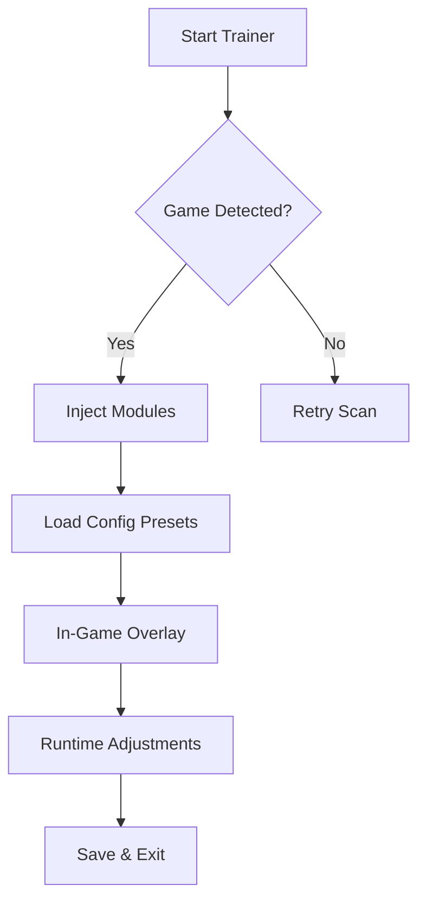

# **Of Ash and Steel Trainer - (2025 Edition)**

In a world forged from embers and hardship, this trainer arrives like a whisper of forbidden craft—helping you bend the iron systems of *Of Ash and Steel* to your will. What follows is a full, polished README designed to guide, intrigue, and empower.

---

## ⚔️ Overview

The **Of Ash and Steel Trainer** is a modern PC companion tool crafted for players who crave deeper control, faster progression, and tactical clarity.
It intertwines performance boosts, adjustable modules, and on-demand scripts into a single streamlined package.

Perfect for campaign dominance, challenge scaling, and experimentation with builds—without the grind.

---

## 🔱 Features

### **Core Enhancements**

* **Dynamic Resource Control** — Shape gold, steel, timber, or influence values with adjustable modifiers.
* **Adaptive Combat Module** — Boost attack precision, reduce incoming damage, or enable timed parry windows.
* **Crafting Accelerator** — Reduces fabrication timers or unlocks complex schematics earlier.
* **Fog-of-War Filter** — Mild radar-style tactical awareness for map progression.
* **Speedframe Engine** — Increase movement flow, animation tempo, or world traversal rate.

### **Optional Scripts**

* Auto-loot pulse
* Bulk crafting queue
* Enemy stat reveal
* Settlement morale stabilizer

[!NOTE]
These scripts can be toggled individually for safer and more stable gameplay.

---

## ⚡ Setup & Installation

1. **Extract** the archive into a clean folder (avoid Desktop/System folders).
2. **Launch** `AshSteel_Trainer.exe` as Administrator.
3. Allow the trainer to auto-bind to your game session.
4. Configure modules using presets like:

   ```ini
   [combat]
   precision_boost=0.35
   damage_reduction=0.20

   [craft]
   timer_scale=0.5
   queue_limit=15
   ```
5. Press `F6` to open the in-game panel.

For custom hotkeys, edit:

```ini
bind_fog_toggle=F4
bind_speedframe=ALT+X
bind_resource_plus=NUMPAD+
```

---

## 🧭 Mermaid Flow (Trainer Operation Path)



---

## ❓ FAQ

### **Does the trainer include invincibility?**

Yes, but it’s part of the *Adaptive Combat Module* as a toggleable sub-feature.

### **Can I create my own presets?**

Absolutely—just copy any `.ini` in the `/configs` folder and rename it.

### **Does it work on ultra-wide or dual-monitor setups?**

Yes, overlays reposition automatically.

### **How often is it updated?**

Minor updates weekly, full compatibility updates within 24–48 hours of major patches.

### **Will it affect story progression?**

No, the trainer avoids modifying quest flags or story states.

---

## 🔥 Final Thoughts

Sometimes the forge of this world pushes too hard, demands too much, or buries its secrets too deep.
This trainer simply opens the gates—letting you play *Of Ash and Steel* the way your spirit desires.

